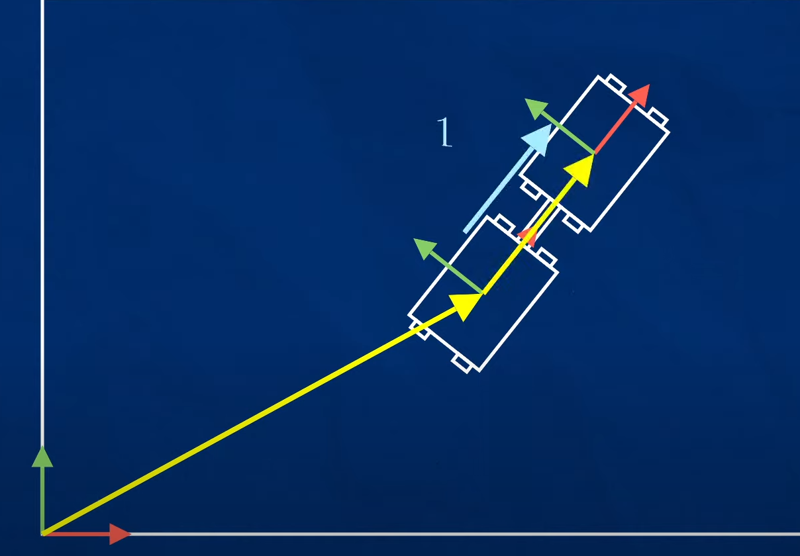
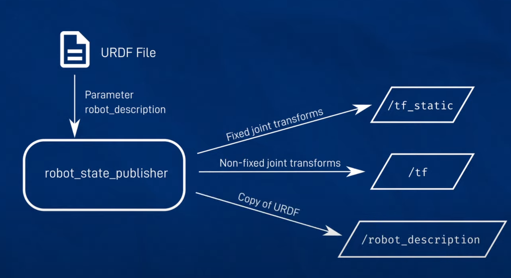
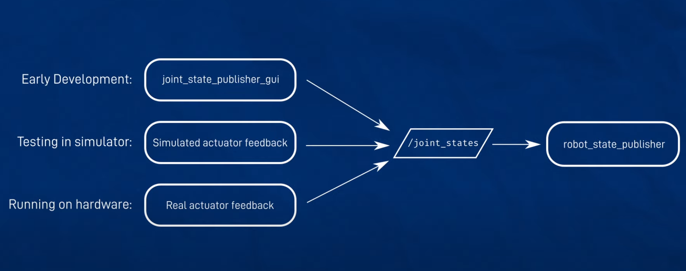

# Doc
## TF 

if the transform is dynamic, the broadcaster has to update the state information regularly so that the system always knows the latest information.

so, these transform happens through Pub, Sub Model and we call them as **Broadcasting and Subscribing**

### Static transformation
1. static transform publisher can be used to do the transform the static data 
1. command `ros2 run tf2_ros static_transform_publisher x y z yaw pitch roll parent_frame child_frame`

1. ros2 run tf2_ros static_transform_publisher 2 0 0 0 0 0 world robot1
1. ros2 run tfs ros_static_transform_publisher 1 0 0 0 0 0 robot1 robot2

1. ros2 run rviz2 rviz

### Dynamic transformation
9976961679

#### URDF
1. A tree of Links connected by Joints
#### TF
1. A tree of Frames connected by Transforms

#### state publishers
Node `robot_state_publisher` takes in a URDF file (param robot_description) and broadcasts(publishes) all the transforms from it.

#### transforms
1. continuous rotation
1. limited rotation
1. linear motion 

And `robot_state_publisher` needs to be dynamic and gonna need angles and linear distances in-order to calculate what the transform needs to be at each point in time.

joint_state_publisher is a temporary solution to publish the state information whch usually received as a feedback from physical or simulation sensors.

1. `ros2 run robot_state_publisher robot_state_publisher --ros-args -p robot_description="$( xacro <file_name.xacro>)"`
1. `ros2 run joint_state_publisher_gui joint_state_publisher_gui`
1. `rviz2`
1. Add TF and show_names, Add robot model and change the description topic to `robot_description`.
1. `ros2 run tf2_tools view_frames.py`

# Save Rviz config
1. in rviz -> save config. Save it in your config folder
1. Launch rviz2 -d <file_path_fileName>

# Save World
1. Save the gazebo world file without the robot
1. Launch gazebo with world parameter, 